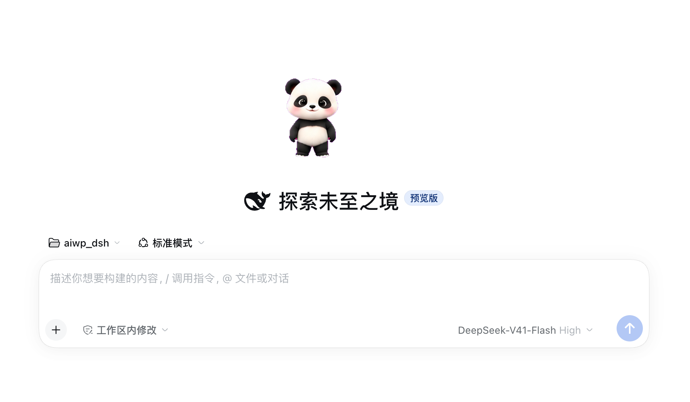
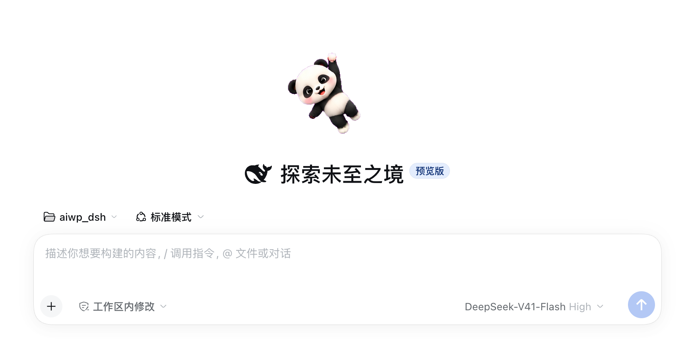
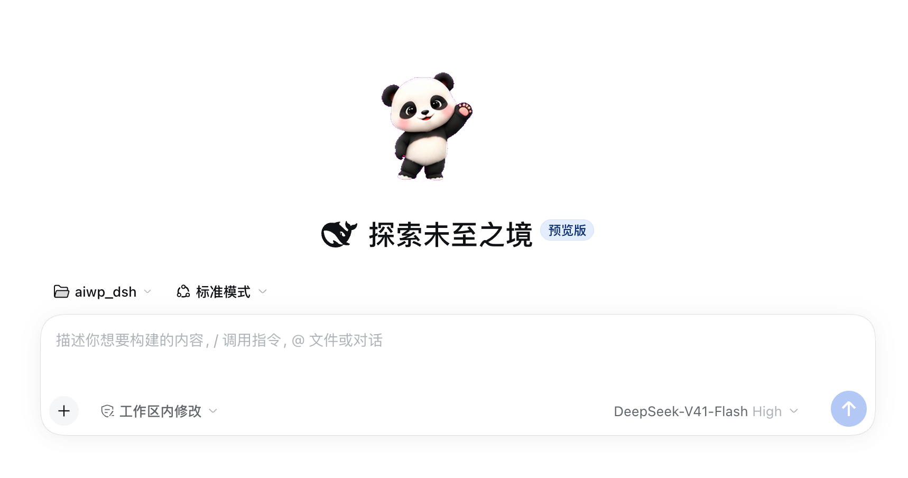

# DSH UI Pando 桌宠

在 [DeepSeek Harness (DSH)](https://github.com/deepseek-ai/deepseek-harness) 的 Web UI 里复刻
[confirmo.love](https://confirmo.love/) 的桌宠体验：一只会动、可拖拽、可换形象的 AI 编码小伙伴，
并支持 [sprites.confirmo.love](https://sprites.confirmo.love/) 社区精灵图。

> 交互、视觉与素材规范均致敬 confirmo.love 及其社区精灵图画廊。

## 📸 效果预览

| 待机 | 拖拽 | 工作状态 |
|---|---|---|
|  |  |  |

| 开心 | 兴奋 | 睡觉 |
|---|---|---|
|  |  |  |

## ✨ 功能

### 7 个精灵状态

每个 sprite 是 **8 列 × 7 行 = 56 帧** 的精灵图，每行一个动画：

| 行 | 状态 | 触发方式 |
|---|---|---|
| Row 1 | 待机 Idle | 默认基础状态 |
| Row 2 | 开心 Happy | **单击**（250ms 手势窗口确认） |
| Row 3 | 兴奋 Excited | **双击** + 整体弹跳 |
| Row 4 | 睡觉 Sleepy | **5 分钟无 agent 动作/宠物交互**自动入睡，3 个 Z 飘动 |
| Row 5 | 工作 Working | 检测到 DSH agent 运行自动切换，齿轮 + 三点加载 + 上飘代码符号 |
| Row 6 | 生气 Angry | **快速连点 5 次** / agent 运行出错 / sprite 加载失败 |
| Row 7 | 拖拽 Dragging | 按住拖动 |

- 手势用**延迟提交（250ms 去抖窗口）**区分单击/双击/连点，不依赖浏览器 `dblclick` 事件
- 状态互斥：工作中/兴奋动画播放中单击不响应；连点 5 次仍可升级为生气
- 任务完成时播放「兴奋(远近缩放) → 开心」庆祝 + 「搞定! ✓」气泡
- 右键菜单含 7 个状态按钮，可 **10 秒预览**每个状态（可被交互打断）

### 社区 sprite 支持

- **在线拉取清单**：菜单支持实时显示社区最新 sprite
- **分层本地缓存**：缓存正在使用的 sprite，提升加载速度
- **抠图**：纯品红 `#ff00ff` 背景自动抠除，移植官网画廊同款流水线，对非标准品红背景（如深紫）也鲁棒
- **空闲预取**：启动预热 + 入睡时用空闲带宽逐个补齐磁盘缓存

### 交互与细节

- 拖拽移动（位置持久化）；右键菜单切换形象 / 大小（96/128/160）/ 状态预览
- 默认位置左下角；形象、位置、大小存于 `localStorage`
- 菜单缩略图统一（processed 缩略图优先，缺失时 canvas 抠图兜底）、深色主题适配
- 尊重系统 `prefers-reduced-motion`

## 📦 安装

推荐用 DSH 的 **Plugin Manager**（设置 → 插件）按本地路径安装，它会把这个包作为 profile
的 bundle 依赖写进 `~/.dsh/profiles/<profile>/package.json` 并建软链：

```
@purezhi/dsh-plugin-pando  →  link:<本仓库>/dsh-plugin-pando
```

也可以手工接线：在目标 profile 的 `package.json` 里把包名加进 `dsh.profile.bundles` 与
`dependencies`（`link:` 指向本仓库），并在 `node_modules/@purezhi/` 下建立同名软链。

**插件集变更需要重启 DSH Desktop**（client-modules 的包元数据在启动时缓存）。
重启后 `window.__DSH_BOOT__` 会包含 `@purezhi/dsh-plugin-pando` 条目，浏览器自动加载桌宠；
node 端路由（`/pando/sprites`、`/pando/sprite`、`/pando/local`、
`/pando/local-sprites`）也随重启注册。

> 因为插件用 `link:` 指向本仓库，**改代码不需要再往 `~/.dsh` 拷贝**：client 端改完刷新页面即可，
> node 端改完需重启应用。

### 显示名称（多语言）

插件卡片的名字/描述来自 `locale/{zh,en}.json`（DSH 官方约定，结构为
`{"meta":{"title","description"}}`）：中文显示 **Pando 桌宠**，英文显示
**Pando Desktop Pet**。`package.json` 的 `description` 作为兜底文案。

## ⚙️ 配置

插件用 DSH 官方的 `export const Config`（schemastery）声明配置。**按 id 覆盖**安装行
（不要用 `insert:`，那会重复声明同一个 id）：

```yaml
- id: pando
  config:
    spriteDir: ~/my-sprites      # 本地精灵图目录（可选）
    cacheDir: ~/pando-cache   # 精灵图缓存目录（可选）
```

| 配置项 | 默认值 | 说明 |
|---|---|---|
| `spriteDir` | `""` | **本地精灵图目录**。放 `<name>/sheet.png`（+ 可选 `thumb.png`）即可：既通过 `/pando/local/<name>/…` 提供文件，也由 `/pando/local-sprites` 自动登记进右键菜单——**无需改代码**。查找顺序在此目录与包内置 `assets/`（QPanda）之前，因此可覆盖内置形象。支持 `~`；相对路径基于工作目录解析 |
| `cacheDir` | `<DSH_HOME>/cache/pando` | **精灵图缓存目录**。社区 sprite 经 `/pando/sprite/<id>` 下载后的持久化落盘位置，浏览器数据清理后仍可复用 |

两个配置项都可省略；省略时只提供内置的 QPanda，缓存落在默认位置。

### 本地精灵目录约定

```
spriteDir/
├── mj/
│   ├── sheet.png     # 必需：8×7 帧、透明背景（prepare.py 产物）
│   ├── thumb.png     # 可选：菜单缩略图；缺失时自动从 sheet 裁第 1 帧
│   └── sprite.json   # 可选：{ "name": "MJ", "preprocessed": true }
└── qpanda/ …
```

- `sprite.json` 可覆盖 `name` / `preprocessed` / `frameWidth` / `frameHeight` / `frameCount`
- 默认按**已预处理**（品红已抠、帧已居中）对待；若放的是带品红底的原始图，加
  `{"preprocessed": false}` 让浏览器端运行时抠图
- sheet 的修改时间会进入缓存键，**重新生成同名精灵不会命中旧缓存**

## 🔌 插件生命周期

启用/停用由 DSH 的插件机制负责，**关闭插件即移除宠物**：

- client 端把宠物 DOM、`<style>`、全部 `setInterval` / `setTimeout` /
  `requestAnimationFrame` 循环、`MutationObserver` 与全局键盘监听都归属同一个 `ctx.effect`
- 插件被停用/卸载（含 HMR 热重载）时 cordis 执行该 effect 的清理函数 → 宠物节点、样式与
  计时器一并释放；重新启用可干净重挂载，不会出现两只宠物
- 因此改 `lib/client.js` 后**刷新页面即可生效**，无需重启应用

## 🔧 开发

```bash
node dsh-plugin-pando/build.js   # 从 client.src.js + sprite_list.json 生成 lib/client.js
```

`lib/client.js` 是浏览器端 bundle（`window.__ModuleLoader__.load(...)` 格式，模块 id 必须与
包名 `@purezhi/dsh-plugin-pando` 一致，DSH 才能把它正确绑定到本插件上并回收），
由 `lib/client.src.js`（源码）+ `sprite_list.json`（社区 sprite 快照）构建而来。

**改动流程**：改 `client.src.js` → `node build.js` → **刷新页面**即可生效（因为 profile 用
`link:` 指向本仓库，无需拷贝）。只有改 `index.js`（node 端路由）才需要重启 DSH Desktop。

手动更新社区 sprite 快照（可选）：

```bash
curl -s "https://api.sprites.confirmo.love/sprites?page=1&limit=20&sort=trending" -o /tmp/trending.json
# 处理后覆盖 sprite_list.json, 再 node build.js
```

手动更新内置 sprite 快照（可选）：

```bash
curl -s "https://api.sprites.confirmo.love/sprites?page=1&limit=20&sort=trending" -o /tmp/trending.json
# 处理后覆盖 sprite_list.json, 再 node build.js
```

## 🗑️ 卸载

```bash
cd pando
./uninstall.sh
```

删除插件包、web 链接和两处 cordis.patch.yml 注册段，重启 DSH Desktop 生效。

## 📁 文件结构

```
pando/
├── LICENSE
├── README.md
├── install.sh / uninstall.sh
├── docs/
│   ├── screenshots/         # 效果预览截图（README 引用）
│   ├── sprites/             # 社区 sprite 素材（git 排除, 用 download-sprites.mjs 重新下载）
│   └── submission/          # 1024Store 插件市场投稿文件
└── dsh-plugin-pando/
    ├── package.json        # 声明 dsh.bundle.patch + dsh.client (platform: web), 导出 ./client
    ├── cordis.patch.yml    # bundle patch: 注册 pando 插件到 cordis 配置
    ├── sprite_list.json    # 内置 sprite 快照(60 个热门 sprite 的 URL 清单)
    ├── build.js            # 构建脚本
    └── lib/
        ├── index.js        # node 端:/pando/sprites 清单代理 + /pando/sprite 磁盘缓存路由
        ├── client.src.js   # 浏览器端源码(猫咪 SVG + 抠图 + 播放引擎 + 手势 + 缓存 + 菜单)
        └── client.js       # 构建产物(ModuleLoader bundle)
```

## 📜 致谢与声明

- 复刻自 [confirmo.love](https://confirmo.love/) 的交互体验与视觉风格，精灵图规范来自
  [sprites.confirmo.love](https://sprites.confirmo.love/) 社区（完整规范见 [`docs/sprite-spec.md`](docs/sprite-spec.md)）
- 精灵图素材版权归各自作者所有；本项目仅嵌入其 URL 清单，运行时从官方服务器加载
- 本项目为独立开源实现，与 confirmo.love 无隶属关系

## ⚖️ License

[MIT](LICENSE)
